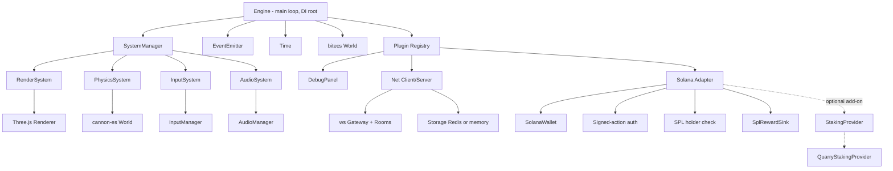

# Architecture

The engine is composed of a small core (loop + DI + plugins + ECS world) and a
set of optional subsystems that plug into it.

## High-level diagram



## Core building blocks

### `Engine`

The root of the dependency graph. It owns:

- A `SystemManager` that orders and runs systems (priority-based).
- A `DependencyContainer` (DI) used by systems and plugins to resolve services.
- A `Time` helper that tracks delta time, elapsed time and FPS.
- An `EventEmitter` (`engine.events`) for engine-wide events.
- A `bitecs` `World` for entity/component storage.
- A `PluginRegistry` for `engine.use(...)`.

### Fixed-timestep loop

To keep simulations deterministic, the loop separates **fixed** updates (logic,
physics) from **variable** render updates with an interpolation factor:

```ts
while (this.acc >= this.fixedDt) {
  this.systems.fixedUpdate(this.fixedDt);
  this.acc -= this.fixedDt;
}
this.systems.update(deltaTime, this.acc / this.fixedDt);
```

Systems receive `(deltaTime, alpha)` where `alpha` is in `[0, 1]` — the
fractional progress through the next fixed step, used by the renderer for
visual interpolation.

### Systems

A `System` is anything with `init? / update? / fixedUpdate? / destroy?` hooks
plus a `priority` so the manager can sort them. Built-in priorities:

- `Priority.Input` (early)
- `Priority.Logic`
- `Priority.Physics` (fixed update)
- `Priority.PostPhysics`
- `Priority.Render` (last)

### Dependency injection

Services are looked up via tokens (`ServiceTokens.Engine`,
`ServiceTokens.Renderer`, etc.). Tokens are nominal so the container is fully
type-safe at the call site.

```ts
const renderer = engine.deps.resolve(ServiceTokens.Renderer);
```

### Plugins

A `Plugin` is a factory that wires services and systems into the engine. Most
subsystems (rendering, physics, networking, devtools) ship as plugins so games
can compose only what they need.

```ts
await engine.use(new RenderPlugin({ canvas }));
await engine.use(new PhysicsPlugin());
await engine.use(new DebugPanel({ enabled: import.meta.env.DEV }));
```

## ECS

Entities are integer ids; components are stored in struct-of-arrays buffers via
`bitecs`. The engine ships a thin `World` wrapper that:

- Tracks entity ids and component types.
- Exposes `world.create()`, `world.destroy()`, `world.has()`.
- Hides the `bitecs` global queries when convenient.

`Scene` groups entities and runs lifecycle hooks. `SceneManager` (mounted on
the engine) loads/unloads scenes.

### Built-in components

- `Transform` — `position`, `rotation`, `scale`.
- `MeshRef` — references a Three.js mesh by id (resolved by `Renderer`).
- `RigidBody` — handle into the cannon-es world.

## Subsystem responsibilities

| Subsystem | Responsibility                                                                                                           |
| --------- | ------------------------------------------------------------------------------------------------------------------------ |
| `render`  | `Renderer` owns the Three.js scene/camera; `RenderSystem` reads ECS components and submits draw calls each variable tick |
| `physics` | `PhysicsWorld` wraps cannon-es; `PhysicsSystem` advances on fixed updates                                                |
| `input`   | `InputManager` normalises kb/mouse/gamepad/touch into device snapshots; `ActionMap` maps them to game actions            |
| `audio`   | `AudioManager` provides master / music / sfx buses on top of WebAudio                                                    |
| `assets`  | Promise-based loader with cache and aggregate progress events                                                            |
| `net`     | `WSGateway` (server), `NetClient` (client), `Room` model, zod protocol, in-memory rate limiter                           |
| `chain`   | Solana wallet, signed-action auth, SPL token gating, reward distribution, optional Quarry staking                        |
| `storage` | `Storage` interface with in-memory default and optional Redis adapter                                                    |

## Type safety

- TypeScript 5 strict, `noUncheckedIndexedAccess`, `exactOptionalPropertyTypes`.
- All public surfaces are typed; no `any` outside the documented optional
  dynamic imports.
- ESM only.
